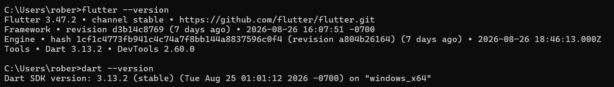
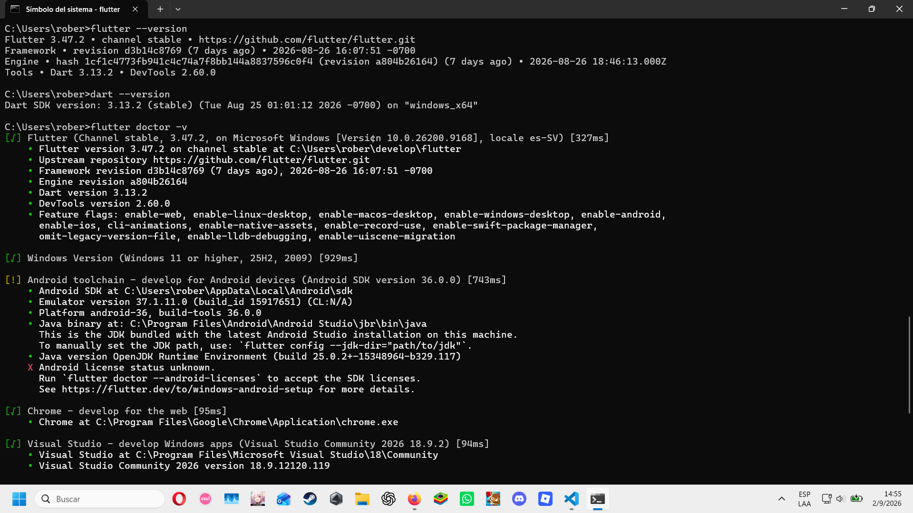
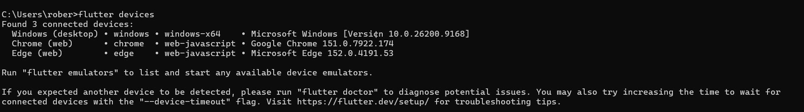
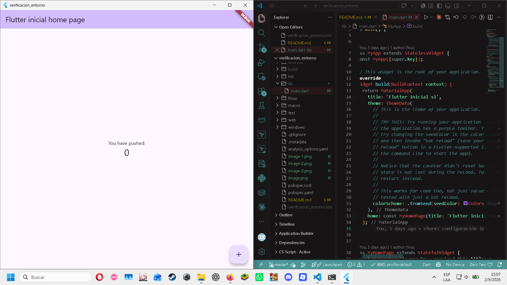

# verificacion_entorno

A new Flutter project.

## Getting Started

This project is a starting point for a Flutter application.

A few resources to get you started if this is your first Flutter project:

- [Learn Flutter](https://docs.flutter.dev/get-started/learn-flutter)
- [Write your first Flutter app](https://docs.flutter.dev/get-started/codelab)
- [Flutter learning resources](https://docs.flutter.dev/reference/learning-resources)

For help getting started with Flutter development, view the
[online documentation](https://docs.flutter.dev/), which offers tutorials,
samples, guidance on mobile development, and a full API reference.

## capturas de pantalla

flutter --version

flutter doctor -v

flutter devices

Antes del cambio (y de algunas pruebas anteriores)

Despues del cambio

## Bitácora

Cantidad de errores que interrumpian la ejecucion del entorno 1

mensaje de error (flutter run):
"Error: Unable to find suitable Visual Studio toolchain. Please run `flutter doctor` for more details."

El error se debía a que en mi maquina no tenia instalado visual studio con la extension de c++, por lo cual
para corregir este error hay que ir a la pagina oficial de visual studio de microsoft y descargarlo (actualmente disponible en su versión VS 2026) https://visualstudio.microsoft.com/es/downloads/.

Luego de haber descargado el visual studio, al momento de llegar a la parte de cargas de trabajo, instala el paquete de "desarrollo para el escritorio c++" despues de eso dale al boton "descargar durante la instalacion" y listo el error deberia de estar solucionado.

Cantidad de avisos 1

mensaje de aviso (flutter doctor -v):
"X Android license status unknown.
      Run `flutter doctor --android-licenses` to accept the SDK licenses.
      See https://flutter.dev/to/windows-android-setup for more details."

Aunque el aviso persiste en la salida de flutter doctor, no bloquea la ejecución porque las licencias ya fueron aceptadas previamente desde Android Studio.